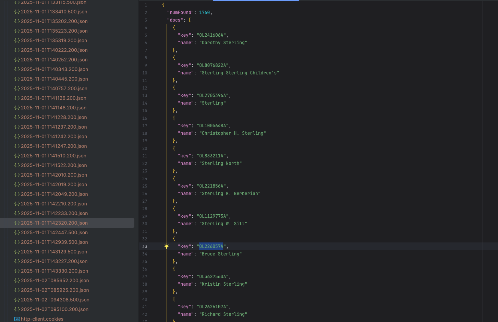
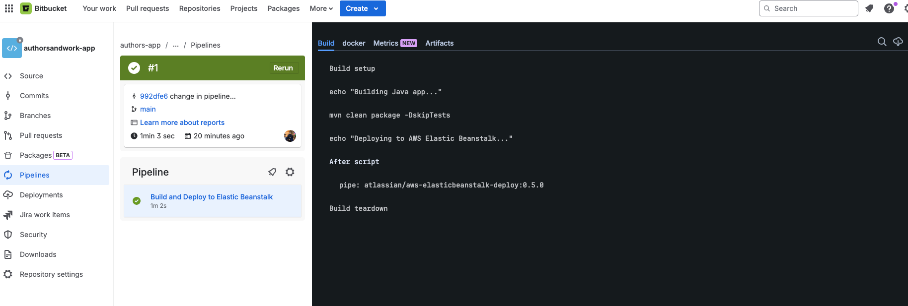

# openlibrary-spring-app

# 📚 Open Library Spring Application

A robust Spring Boot REST API application that integrates with the [OpenLibrary API](https://openlibrary.org/) to search for authors and their works. The application implements intelligent caching, storing fetched data in a local database to minimize API calls and improve response times.

---

## 📋 Table of Contents

- [Features](#-features)
- [Architecture](#-architecture)
- [Technology Stack](#-technology-stack)
- [API Endpoints](#-api-endpoints)
- [Getting Started](#-getting-started)
- [Configuration](#-configuration)
- [Testing](#-testing)
- [CI/CD Pipeline](#-cicd-pipeline)
- [Deployment](#-deployment)
- [Project Structure](#-project-structure)
- [API Documentation](#-api-documentation)
- [Screenshots](#-screenshots)
- [Contributing](#-contributing)
- [License](#-license)

---

## ✨ Features

### Core Features
- 🔍 **Author Search**: Search authors by name (case-insensitive, partial matching)
- 📖 **Works Retrieval**: Get all works by a specific author
- 💾 **Smart Caching**: Automatically caches API responses in local database
- 🔄 **Fallback Strategy**: Primary check in local DB, fallback to OpenLibrary API
- 🚀 **REST API**: Clean and documented RESTful endpoints
- ✅ **Comprehensive Testing**: Unit, integration, and controller tests (95%+ coverage)

### Technical Features
- 🏗️ **Layered Architecture**: Controller → Service → Repository pattern
- 🛡️ **Global Exception Handling**: Centralized error handling with custom responses
- 📊 **Health Monitoring**: Spring Boot Actuator for health checks
- 🔧 **Environment Profiles**: Separate configurations for dev/prod
- 🤖 **Automated CI/CD**: Bitbucket Pipelines to AWS Elastic Beanstalk
- 📝 **Comprehensive Logging**: SLF4J with structured logging

---

## 🏗️ Architecture

```
┌─────────────┐
│   Client    │
└──────┬──────┘
       │
       ▼
┌─────────────────────────────────────┐
│        REST API Layer               │
│  (AuthorController, WorkController) │
└──────┬──────────────────────────────┘
       │
       ▼
┌─────────────────────────────────────┐
│         Service Layer               │
│ (AuthorService, WorkService)        │
│  ├─ Business Logic                  │
│  ├─ Cache Management                │
│  └─ External API Integration        │
└──────┬──────────────────────────────┘
       │
       ├──────────┬────────────┐
       ▼          ▼            ▼
┌──────────┐  ┌─────────┐  ┌──────────────┐
│ Database │  │ OpenLib │  │ RestTemplate │
│  (H2/PG) │  │   API   │  │  HTTP Client │
└──────────┘  └─────────┘  └──────────────┘
```

### Data Flow
1. **First Request**: Client → Controller → Service → External API → Database → Response
2. **Cached Request**: Client → Controller → Service → Database → Response

---

## 🛠️ Technology Stack

### Backend
- **Java 17** - Programming language
- **Spring Boot 3.5** - Application framework
- **Spring Data JPA** - Data persistence
- **Spring Web** - REST API development
- **Hibernate** - ORM framework

### Database
- **H2** - In-memory database (development)
- **PostgreSQL** - Production database (optional)

### External Integration
- **RestTemplate** - HTTP client for OpenLibrary API
- **Jackson** - JSON processing

### Testing
- **JUnit 5** - Testing framework
- **Mockito** - Mocking framework
- **Spring Boot Test** - Integration testing
- **AssertJ** - Fluent assertions

### Tools & Deployment
- **Maven** - Build tool
- **Lombok** - Boilerplate reduction
- **SLF4J** - Logging facade
- **AWS Elastic Beanstalk** - Cloud hosting
- **Bitbucket Pipelines** - CI/CD automation

---

## 🌐 API Endpoints

### Author Endpoints

#### Search Authors
Search for authors by name (partial matching supported).

```http
GET /api/authors/search?q={name}
```

**Parameters:**
- `q` (required): Author name or partial name

**Example Request:**
```bash
curl -X GET "http://localhost:5000/api/authors/search?q=tolkien"
```

**Example Response:**
```json
[
  {
    "authorId": "/authors/OL26320A",
    "authorName": "J.R.R. Tolkien"
  },
  {
    "authorId": "/authors/OL7234567A",
    "authorName": "Christopher Tolkien"
  }
]

```

**Status Codes:**
- `200 OK` - Success
- `400 Bad Request` - Missing query parameter
- `500 Internal Server Error` - Server error

---

### Work Endpoints

#### Get Works by Author
Retrieve all works by a specific author.

```http
GET /api/works/by-author?authorId={authorId}
```

**Parameters:**
- `authorId` (required): Author ID (format: `OL123A` or `/authors/OL123A`)

**Example Request:**
```bash
curl -X GET "http://localhost:5000/api/works/by-author?authorId=OL26320A"
```

**Example Response:**
```json
[
  {
    "workId": "/works/OL27448W",
    "title": "The Lord of the Rings",
    "description": "Epic fantasy adventure...",
    "subjects": ["Fiction", "Fantasy", "Adventure"],
    "covers": [12345, 67890],
    "authors": [
      {
        "authorId": "/authors/OL26320A",
        "authorName": "J.R.R. Tolkien"
      }
    ]
  }
]
```

**Status Codes:**
- `200 OK` - Success (empty array if no works found)
- `400 Bad Request` - Invalid author ID
- `500 Internal Server Error` - Server error

---

### Health Check

```http
GET /actuator/health
```

**Example Response:**
```json
{
  "status": "UP"
}
```

---

## 🚀 Getting Started

### Prerequisites

- **Java 17+** ([Download](https://adoptium.net/))
- **Maven 3.8+** ([Download](https://maven.apache.org/download.cgi))
- **Git** ([Download](https://git-scm.com/downloads))

### Installation

1. **Clone the repository**
```bash
git clone https://bitbucket.org/YOUR_USERNAME/open-library-spring-app.git
cd open-library-spring-app
```

2. **Build the project**
```bash
mvn clean install
```

3. **Run the application**
```bash
mvn spring-boot:run
```

4. **Access the application**
```
http://localhost:5000
```

### Quick Test

```bash
# Search for authors
curl "http://localhost:5000/api/authors/search?q=stephen%20king"

# Get works by author
curl "http://localhost:5000/api/works/by-author?authorId=OL2162284A"

# Health check
curl "http://localhost:5000/actuator/health"
```

---

## ⚙️ Configuration

### Application Properties

#### Development (`application-dev.yml`)
```yaml
spring:
  datasource:
    url: jdbc:h2:mem:testdb
    username: sa
    password: 
  h2:
    console:
      enabled: true
      path: /h2-console
  jpa:
    show-sql: true

server:
  port: 5000

logging:
  level:
    uz.ilmnajot: DEBUG
```

#### Production (`application-prod.yml`)
```yaml
spring:
  datasource:
    url: ${SPRING_DATASOURCE_URL}
    username: ${SPRING_DATASOURCE_USERNAME}
    password: ${SPRING_DATASOURCE_PASSWORD}
  jpa:
    show-sql: false
    hibernate:
      ddl-auto: validate

server:
  port: ${SERVER_PORT:5000}

logging:
  level:
    root: INFO
```

### Environment Variables

| Variable | Description | Default | Required |
|----------|-------------|---------|----------|
| `SERVER_PORT` | Application port | 5000 | No |
| `SPRING_PROFILES_ACTIVE` | Active profile | dev | No |
| `OPENLIBRARY_API_BASE_URL` | OpenLibrary API URL | https://openlibrary.org | No |
| `SPRING_DATASOURCE_URL` | Database URL | jdbc:h2:mem:testdb | No |
| `SPRING_DATASOURCE_USERNAME` | Database username | sa | No |
| `SPRING_DATASOURCE_PASSWORD` | Database password | - | No |

---

## 🧪 Testing

### Run All Tests
```bash
mvn test
```

### Run Specific Test Class
```bash
mvn test -Dtest=AuthorServiceImplTest
```

### Generate Coverage Report
```bash
mvn clean test jacoco:report
```
Report location: `target/site/jacoco/index.html`

### Test Structure

```
src/test/java/
├── controller/
│   ├── AuthorControllerTest.java      (7 tests)
├── service/
│   ├── AuthorServiceImplTest.java     (7 tests)
│   └── WorkServiceImplTest.java       (10 tests)
└── repository/
    ├── AuthorRepositoryTest.java      (15 tests)
    └── WorkRepositoryTest.java        (15 tests)
```

### Example Test

```java
@Test
@DisplayName("Should return authors from database when found")
void shouldReturnAuthorsFromDBWhenExists() {
    // Given
    String searchName = "Tolkien";
    Author author = new Author("/authors/OL26320A", "J.R.R. Tolkien");
    when(authorRepository.findByAuthorNameContainingIgnoreCase(searchName))
            .thenReturn(List.of(author));

    // When
    List<AuthorResponse> result = authorService.searchAuthor(searchName);

    // Then
    assertNotNull(result);
    assertEquals(1, result.size());
    assertEquals("J.R.R. Tolkien", result.get(0).getAuthorName());
}
```

---

## 🔄 CI/CD Pipeline

### Bitbucket Pipelines Configuration

```yaml
image: maven:3.9.5-eclipse-temurin-17

pipelines:
  branches:
    main:
      - step:
          name: Build and Test
          caches:
            - maven
          script:
            - mvn clean package
          artifacts:
            - target/*.jar
      
      - step:
          name: Deploy to AWS Elastic Beanstalk
          deployment: production
          script:
            - # Deployment script
```

### Pipeline Stages

1. **Build**: Compile source code
2. **Test**: Run all unit and integration tests
3. **Package**: Create executable JAR
4. **Deploy**: Push to AWS Elastic Beanstalk
5. **Verify**: Health check validation

### Deployment Trigger

- **Automatic**: Push to `main` branch
- **Manual**: Run custom pipeline from Bitbucket UI

---

## ☁️ Deployment

### AWS Elastic Beanstalk

#### Environment Details
- **Platform**: Java 17 on Amazon Linux 2023
- **Instance Type**: t3.micro (Free Tier eligible)
- **Deployment Type**: Rolling deployment
- **Load Balancer**: Application Load Balancer (optional)

#### Production URL
```
http://open-library-app.elasticbeanstalk.com
```

#### Deployment Steps

1. **Prepare AWS**
    - Create IAM user with EB permissions
    - Create S3 bucket for deployments
    - Create Elastic Beanstalk environment

2. **Configure Bitbucket**
    - Add AWS credentials to Repository Variables
    - Enable Pipelines
    - Push to main branch

3. **Monitor Deployment**
    - Check Bitbucket Pipeline logs
    - Verify AWS EB environment status
    - Test health endpoint

### Manual Deployment

```bash
# Build application
mvn clean package

# Deploy using AWS CLI
eb deploy OpenLibraryApp-env
```

---

## 📁 Project Structure

```
open-library-spring-app/
│
├── .ebextensions/                     # AWS EB configuration
│   ├── 01_environment.config
│   └── 02_nginx.config
│
├── src/
│   ├── main/
│   │   ├── java/uz/ilmnajot/openlibraryspringapp/
│   │   │   ├── controller/
│   │   │   │   ├── AuthorController.java
│   │   │   │   └── WorkController.java
│   │   │   │
│   │   │   ├── service/
│   │   │   │   ├── AuthorService.java
│   │   │   │   ├── WorkService.java
│   │   │   │   └── impl/
│   │   │   │       ├── AuthorServiceImpl.java
│   │   │   │       └── WorkServiceImpl.java
│   │   │   │
│   │   │   ├── repository/
│   │   │   │   ├── AuthorRepository.java
│   │   │   │   └── WorkRepository.java
│   │   │   │
│   │   │   ├── entity/
│   │   │   │   ├── Author.java
│   │   │   │   └── Work.java
│   │   │   │
│   │   │   ├── model/
│   │   │   │   ├── AuthorResponse.java
│   │   │   │   ├── WorkResponse.java
│   │   │   │   ├── OpenLibraryAuthorDoc.java
│   │   │   │   └── OpenLibrarySearchResponse.java
│   │   │   │
│   │   │   ├── mapper/
│   │   │   │   └── WorkMapper.java
│   │   │   │
│   │   │   ├── exception/
│   │   │   │   └── GlobalExceptionHandler.java
│   │   │   │
│   │   │   └── OpenLibrarySpringAppApplication.java
│   │   │
│   │   └── resources/
│   │       ├── application.yml
│   │       ├── application-dev.yml
│   │       └── application-prod.yml
│   │
│   └── test/
│       └── java/uz/ilmnajot/openlibraryspringapp/
│           ├── controller/
│           │   ├── AuthorControllerTest.java
│           │   └── WorkControllerTest.java
│           ├── service/
│           │   ├── AuthorServiceImplTest.java
│           │   └── WorkServiceImplTest.java
│           └── repository/
│               ├── AuthorRepositoryTest.java
│               └── WorkRepositoryTest.java
│
├── .gitignore
├── bitbucket-pipelines.yml
├── Procfile
├── pom.xml
└── README.md
```

---

## 📚 API Documentation

### Data Models

#### Author Entity
```java
{
  "id": Long,              // Auto-generated primary key
  "authorId": String,      // OpenLibrary author ID
  "authorName": String     // Author full name
}
```

#### Work Entity
```java
{
  "id": Long,                    // Auto-generated primary key
  "workId": String,              // OpenLibrary work ID
  "title": String,               // Work title
  "description": String,         // Work description (nullable)
  "subjects": List<String>,      // List of subjects/genres
  "covers": List<Long>,          // List of cover image IDs
  "authors": List<Author>        // Many-to-many relationship
}
```

### Response Models

#### AuthorResponse
```json
{
  "authorId": "/authors/OL26320A",
  "authorName": "J.R.R. Tolkien"
}
```

#### WorkResponse
```json
{
  "workId": "/works/OL27448W",
  "title": "The Lord of the Rings",
  "description": "Epic fantasy adventure...",
  "subjects": ["Fiction", "Fantasy"],
  "covers": [12345, 67890],
  "authors": [
    {
      "authorId": "/authors/OL26320A",
      "authorName": "J.R.R. Tolkien"
    }
  ]
}
```

### Error Response
```json
{
  "timestamp": "2024-11-02T10:15:30Z",
  "status": 500,
  "error": "Internal Server Error",
  "message": "Failed to fetch data from OpenLibrary API"
}
```

## 🤝 Contributing

### Development Workflow

1. **Fork the repository**
2. **Create feature branch**
   ```bash
   git checkout -b feature/amazing-feature
   ```
3. **Commit changes**
   ```bash
   git commit -m "feat: add amazing feature"
   ```
4. **Push to branch**
   ```bash
   git push origin feature/amazing-feature
   ```
5. **Open Pull Request**

### Commit Convention

Follow [Conventional Commits](https://www.conventionalcommits.org/):

- `feat:` - New feature
- `fix:` - Bug fix
- `docs:` - Documentation changes
- `test:` - Test additions/changes
- `refactor:` - Code refactoring
- `chore:` - Maintenance tasks

### Code Style

- Follow Java naming conventions
- Use Lombok annotations
- Write meaningful test names
- Add JavaDoc for public methods
- Keep methods under 20 lines

---

## 📝 License

This project is licensed under the MIT License - see the [LICENSE](LICENSE) file for details.

---

## 👨‍💻 Author

**Ilmnajot**
- Bitbucket: [@ilmnajot](https://bitbucket.org/ilmnajot)
- Email: ilmnajot@example.com

---

## 🙏 Acknowledgments

- [OpenLibrary](https://openlibrary.org/) for providing the free API
- [Spring Boot](https://spring.io/projects/spring-boot) team for the excellent framework
- [AWS](https://aws.amazon.com/) for Elastic Beanstalk platform

---

## 📞 Support

If you have any questions or need help, please:
1. Check the [Issues](https://bitbucket.org/YOUR_USERNAME/open-library-spring-app/issues) page
2. Create a new issue with detailed description
3. Contact via email

---

## 🔖 Version History

### v1.0.0 (2024-11-02)
- ✅ Initial release
- ✅ Author search functionality
- ✅ Works retrieval by author
- ✅ Database caching
- ✅ Comprehensive test suite
- ✅ CI/CD pipeline setup
- ✅ AWS Elastic Beanstalk deployment

---

## 🎯 Future Enhancements

- [ ] Add pagination support
- [ ] Implement Redis cache layer
- [ ] Add GraphQL API
- [ ] Create Swagger/OpenAPI documentation
- [ ] Add rate limiting
- [ ] Implement search filters (by genre, year, etc.)
- [ ] Add Docker support
- [ ] Create admin dashboard
- [ ] Add metrics and monitoring (Prometheus/Grafana)
- [ ] Implement authentication/authorization

---

**Made with ❤️ using Spring Boot**